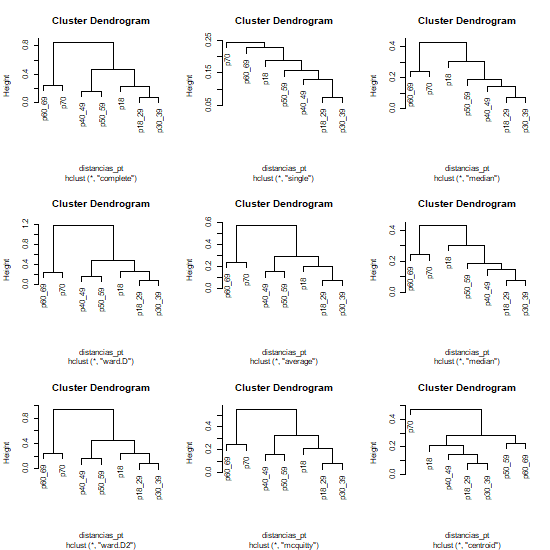

# 1. Datos

Los datos utilizados para este análisis fueron tomados de la página de la Secretaría de Salud <https://coronavirus.gob.mx/>, donde se colectaron todos los casos de COVID-19 que se registraron en el país. Para este caso, la base de datos se filtró previamente para tener exclusivamente los casos para el estado de Querétaro. 

Estos casos fueron colectados desde el día 1 de enero de 2020 hasta el 18 de octubre de 2021. 

# 2. Observacion inicial

Este proyecto parte al observar la grafica de casos positivos de COVID-19 para el estado de Querétaro por estructura de edad, donde se marca la observación de que los casos no son homogéneos en las edades presentadas, sino que hay más casos de ciertas edades en específico durante ciertos periodos de tiempo. 

Esto pone en pie la idea de que la edad del paciente es importante para determinar la dinámica de las infecciones de COVID-19. 

```{r message=FALSE, warning=FALSE}
library(plotly)
source("02_Scripts/01 Grafica de casos positivos.R")
ggplotly(plot_positivos_re)
```

# 3. Probabilidades de transicion

Con esta observación, se determinaron las probabilidades de transición entre estados, con base en el modelo de la CDMX. Estas probabilidades se obtuvieron por cada rango de edad de todos los casos que estan involucrados en la transición. 

```{r}
load("03_Out/OutData/probabilidades_de_transicion.RData")
probabilidades_de_transicion
```

# 4. Definición de grupos etarios

Para el estableimiento del modelo es necesario establecer las categorias de edades con base en las probabilidades de transición. Para esto, se realiza un análisis de clusterización, donde los grupos de edad se agrupan de acuerdo a la distancia entre las probabilidades de transición, es decir, para aquellas probabilidades que sean más parecidas o menos distantes, seran agrupadas en un conjunto. 



Con este análisis, se obtuvieron cuatro grupos etarios por el cual se va a desarrollar el modelo:

+ **Grupo 1: ** Pacientes menores de 18 años
+ **Grupo 2: ** Pacientes entre 18 a 39 años
+ **Grupo 3: ** Pacientes entre 40 a 59 años
+ **Grupo 4: ** Pacientes entre 60 hasta mayores de 70 años

# 5. Definición del modelo

## 5.1 Diagrama por compartimentos

Este diagrama fue elaborado con base al modelo de la CDMX <https://modelo.covid19.cdmx.gob.mx/>, al cual se le modificaron los compartimentos establecidos, ya que estos fueron definidos con base a las probabilidades de transición obtenidas con los datos públicos.


## 5.2 Definición de los parámteros

+----------------+------------------------------------------------------------+
| Parámetros     | Significado                                                |
+================+============================================================+
| $\beta$        | Tasa de infección por la interacción $SI$ y $SI_l$ **Este parámetro tiene estructura de edad** |
+----------------+------------------------------------------------------------+
| $\alpha$       | Tasa a la que los individuos expuestos se vuelven infectantes |
| $p_l$          | Fracción de individuos infectados que no son hospitalizados, se vuelven infectados leves $0 \le p_g \le 1$ **Este parámetro tiene estructura de edad** |
+----------------+------------------------------------------------------------+
| $p_h$          | Fracción de individuos infectados que son hospitalizados $0 \le p_g \le 1$ **Este parámetro tiene estructura de edad** |
+----------------+------------------------------------------------------------+
| $\delta_l$     | Tasa a la que los individuos infectados se vuelven infectados leves/ambulatorios |
+----------------+------------------------------------------------------------+
| $\delta_h$     | Tasa a la que los individuos infectados se vuelven infectados hospitalizados/graves |
+----------------+------------------------------------------------------------+
| $\gamma _R$    | Tasa en la que los individuos infectados leves se recuperan |
+----------------+------------------------------------------------------------+
| $p_i$          | Fracción de individuos hospitalizados que son intubados $0 \le p_i \le 1$ **Este parámetro tiene estructura de edad** |
+----------------+------------------------------------------------------------+
| $(1-p_i)$      | Resto de individuos hospitalizados que no son intubados, se recuperan | 
+----------------+------------------------------------------------------------+
| $\gamma _h$    | Tasa a la que los individuos hospitalizados se recuperan |
+----------------+------------------------------------------------------------+
| $\delta _i$    | Tasa a la que los individuos hospitalizados son intubados | 
+----------------+------------------------------------------------------------+
| $\mu$          | Fracción de individuos intubados que mueren $0 \le \mu \le 1$ **Este parámetro tiene estructura de edad** |
+----------------+------------------------------------------------------------+
| $(1-\mu)$      | Resto de individuos intubados que no mueren, se recuperan |
+----------------+------------------------------------------------------------+
| $\delta _m$    | Tasa a la que los individuos intubados mueren |
+----------------+------------------------------------------------------------+
| $\gamma _i$    | Tasa a la que los individuos intubados se recuperan |
+----------------+------------------------------------------------------------+

### 5.2.1 Valor de los parámetros

+----------------+------------+
| Parámetros     | Valor      | 
+================+============+
| $\beta _1$     | 0.3771645  |
+----------------+------------+
| $\beta _2$     | 0.4473864  |
+----------------+------------+
| $\beta _3$     | 0.5090940  |
+----------------+------------+
| $\beta _4$     | 0.5638485  |
+----------------+------------+
| $\alpha$       | 1/Dincub   |
+----------------+------------+
| $p _{l1}$      | 0.9746533  |
+----------------+------------+
| $p _{l2}$      | 0.9610823  |
+----------------+------------+
| $p _{l3}$      | 0.8420886  |
+----------------+------------+
| $p _{l4}$      | 0.5567019  |
+----------------+------------+
| $p _{h1}$      | 0.02534672 |
+----------------+------------+
| $p _{h2}$      | 0.03891768 |
+----------------+------------+
| $p _{h3}$      | 0.15791136 |
+----------------+------------+
| $p _{h4}$      | 0.44329812 |
+----------------+------------+
| $\delta _l$    | 1/Dinfect  |
+----------------+------------+
| $\delta _h$    | 1/Dhosp    |
+----------------+------------+
| $\gamma _R$    | 1/DRL      |
+----------------+------------+
| $p_{i1}$       | 0.09433962 |
+----------------+------------+
| $p_{i2}$       | 0.11152620 |
+----------------+------------+
| $p_{i3}$       | 0.18827911 |  
+----------------+------------+
| $p_{i4}$       | 0.21197680 |
+----------------+------------+
| $\delta _i$    | 1/DICU     |
+----------------+------------+
| $\gamma _h$    | 1/DRH      |
+----------------+------------+
| $\mu _1$       | 0.5000000  |
+----------------+------------+
| $\mu _2$       | 0.6896226  |
+----------------+------------+
| $\mu _3$       | 0.8224699  |
+----------------+------------+
| $\mu _4$       | 0.8972645  |
+----------------+------------+
| $\delta _m$    | 1/DM       |
+----------------+------------+
| $\gamma _i$    | 1/DRICU    |
+----------------+------------+

### 5.2.2 Parámetros adicionales

+------------+--------+-------------------------------------------------------+
| Parámetro  | Valor  | Significado                                           |
+============+========+=======================================================+
| Dincub     | 5.6    | Tiempo de incubación (dias) (Quesada et al., 2021 DOI: 10.1016/j.rceng.2020.08.002) |
+------------+--------+-------------------------------------------------------+
| Dinfect    | 5.5    | Tiempo en el que es infeccioso el paciente (Xin et al., 2021 https://doi.org/10.1093/cid/ciab746) |
+------------+--------+-------------------------------------------------------+
| DRL        | 14     | Tiempo de recuperacion de casos leves (dias) (Se mantiene de diversas fuentes ) |
+------------+--------+-------------------------------------------------------+
| Dhosp      | 4      | Tiempo entre presencia de sintomas y hospitalización en casos graves (dias) |
+------------+--------+-------------------------------------------------------+
| DRH        | 12     | Tiempo entre hospitalizacion de casos gravez no UCI y recuperacion (dias) |
+------------+--------+-------------------------------------------------------+
| DM         | 8      | Tiempo entre ingreso a UCI y deceso                   |
+------------+--------+-------------------------------------------------------+
| DRICU      | 7      | Tiempo entre ingreso a UCI y recuperación (dias)      |
+------------+--------+-------------------------------------------------------+
| DICU       | 1      | Tiempo entre ingreso a hospitalización e ingreso a UCI |
+------------+--------+-------------------------------------------------------+

## 5.3 Variables

**Grupo 1**

- $S_1$ : individuos suceptibles del grupo 1
- $E_1$ : individuos expuestos infectados pero no infectantes del grupo 1
- $I_1$ : individuos infectados que son infectantes del grupo 1
- $I_{l1}$ : individuos infectados leves del grupo 1
- $I_{h1}$ : individuos infectados hospitalizados del grupo 1
- $I_{i1}$ : individuos infectados intubados del grupo 1
- $R_1$ : individuos recuperados del grupo 1
- $M_1$ : individuos muertos del grupo 1

**Grupo 2**

- $S_2$ : individuos suceptibles del grupo 2
- $E_2$ : individuos expuestos infectados pero no infectantes del grupo 2
- $I_2$ : individuos infectados que son infectantes del grupo 2
- $I_{l2}$ : individuos infectados leves del grupo 2
- $I_{h2}$ : individuos infectados hospitalizados del grupo 2
- $I_{i2}$ : individuos infectados intubados del grupo 2
- $R_2$ : individuos recuperados del grupo 2
- $M_2$ : individuos muertos del grupo 2

**Grupo 3**

- $S_3$ : individuos suceptibles del grupo 3
- $E_3$ : individuos expuestos infectados pero no infectantes del grupo 3
- $I_3$ : individuos infectados que son infectantes del grupo 3
- $I_{l3}$ : individuos infectados leves del grupo 3
- $I_{h3}$ : individuos infectados hospitalizados del grupo 3
- $I_{i3}$ : individuos infectados intubados del grupo 3
- $R_3$ : individuos recuperados del grupo 3
- $M_3$ : individuos muertos del grupo 3

**Grupo 4**

- $S_4$ : individuos suceptibles del grupo 4
- $E_4$ : individuos expuestos infectados pero no infectantes del grupo 4
- $I_4$ : individuos infectados que son infectantes del grupo 4
- $I_{l4}$ : individuos infectados leves del grupo 4
- $I_{h4}$ : individuos infectados hospitalizados del grupo 4
- $I_{i4}$ : individuos infectados intubados del grupo 4
- $R_4$ : individuos recuperados del grupo 4
- $M_4$ : individuos muertos del grupo 4

## 5.4 Ecuaciones

$$\begin{array}{l}
\text{Para el grupo 1 :} \\
\dot S_1 = \frac { -\beta_1 S_1 * ( I_1 + I_2 + I_3 + I_4 + I_{l1} + I_{l2} + I_{l3} + I_{l4} ) } {N} \\
\dot E_1 = \frac { \beta_1 S_1 * ( I_1 + I_2 + I_3 + I_4 + I_{l1} + I_{l2} + I_{l3} + I_{l4} ) } {N} - \alpha E_1 \\
\dot I_1 = \alpha E_1 - p_{h1} \delta_g I_1 - p_{l1} \delta_l I_1 \\
\dot I_{l1} = p_{l1} \delta_l I_1 - \gamma _R I_{l1} \\
\dot I_{h1} = p_{h1} \delta_g I_1 - p_{i1} \delta _h I_{h1} - (1-p_{i1}) \gamma _h I_{h1} \\
\dot I_{i1} = p_{i1} \delta _h I_{h1} - \mu _1 \delta _i I_{i1} - (1-\mu_1)\gamma _i I_{i1} \\
\dot M_1 = \mu_1 \delta _i I_{i1} \\ 
\dot R_1 = \gamma _R I_{l1} + (1-p_{i1} ) \gamma _h I_{h1} + ( 1-\mu_1 ) \gamma _i I_{i1}
\\
\\
\text{Para el grupo 2 :} \\
\dot S_2 = \frac { -\beta_2 S_2 * ( I_1 + I_2 + I_3 + I_4 + I_{l1} + I_{l2} + I_{l3} + I_{l4} ) } {N} \\
\dot E_2 = \frac { \beta_2 S_2 * ( I_1 + I_2 + I_3 + I_4 + I_{l1} + I_{l2} + I_{l3} + I_{l4} ) } {N} - \alpha E_2 \\
\dot I_2 = \alpha E_2 - p_{h2} \delta_g I_2 - p_{l2} \delta_l I_2 \\
\dot I_{l2} = p_{l2} \delta_l I_2 - \gamma _R I_{l2} \\
\dot I_{h2} = p_{h2} \delta_g I_2 - p_{i2} \delta _h I_{h2} - (1-p_{i2}) \gamma _h I_{h2} \\
\dot I_{i2} = p_{i2} \delta _h I_{h2} - \mu _2 \delta _i I_{i2} - (1-\mu_2)\gamma _i I_{i2} \\
\dot M_2 = \mu_2 \delta _i I_{i2} \\ 
\dot R_2 = \gamma _R I_{l2} + (1-p_{i2} ) \gamma _h I_{h2} + ( 1-\mu_2 ) \gamma _i I_{i2}
\\
\\
\text{Para el grupo 3 :} \\
\dot S_3 = \frac { -\beta_3 S_3 * ( I_1 + I_2 + I_3 + I_4 + I_{l1} + I_{l2} + I_{l3} + I_{l4} ) } {N} \\
\dot E_3 = \frac { \beta_3 S_3 * ( I_1 + I_2 + I_3 + I_4 + I_{l1} + I_{l2} + I_{l3} + I_{l4} ) } {N} - \alpha E_3 \\
\dot I_3 = \alpha E_3 - p_{h3} \delta_g I_3 - p_{l3} \delta_l I_3 \\
\dot I_{l3} = p_{l3} \delta_l I_3 - \gamma _R I_{l3} \\
\dot I_{h3} = p_{h3} \delta_g I_3 - p_{i3} \delta _h I_{h3} - (1-p_{i3}) \gamma _h I_{h3} \\
\dot I_{i3} = p_{i3} \delta _h I_{h3} - \mu _3 \delta _i I_{i3} - (1-\mu_3)\gamma _i I_{i3} \\
\dot M_3 = \mu_3 \delta _i I_{i3} \\ 
\dot R_3 = \gamma _R I_{l3} + (1-p_{i3} ) \gamma _h I_{h3} + ( 1-\mu_3 ) \gamma _i I_{i3}
\\
\\
\text{Para el grupo 4 :} \\
\dot S_4 = \frac { -\beta_4 S_4 * ( I_1 + I_2 + I_3 + I_4 + I_{l1} + I_{l2} + I_{l3} + I_{l4} ) } {N} \\
\dot E_4 = \frac { \beta_4 S_4 * ( I_1 + I_2 + I_3 + I_4 + I_{l1} + I_{l2} + I_{l3} + I_{l4} ) } {N} - \alpha E_4 \\
\dot I_4 = \alpha E_4 - p_{h4} \delta_g I_4 - p_{l4} \delta_l I_4 \\
\dot I_{l4} = p_{l4} \delta_l I_4 - \gamma _R I_{l4} \\
\dot I_{h4} = p_{h4} \delta_g I_4 - p_{i4} \delta _h I_{h4} - (1-p_{i4}) \gamma _h I_{h4} \\
\dot I_{i4} = p_{i4} \delta _h I_{h4} - \mu _4 \delta _i I_{i4} - (1-\mu_4)\gamma _i I_{i4} \\
\dot M_4 = \mu_4 \delta _i I_{i4} \\ 
\dot R_4 = \gamma _R I_{l4} + (1-p_{i4} ) \gamma _h I_{h4} + ( 1-\mu_4 ) \gamma _i I_{i4}
\end{array}$$


