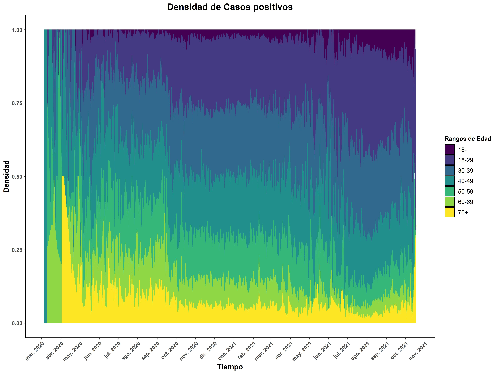
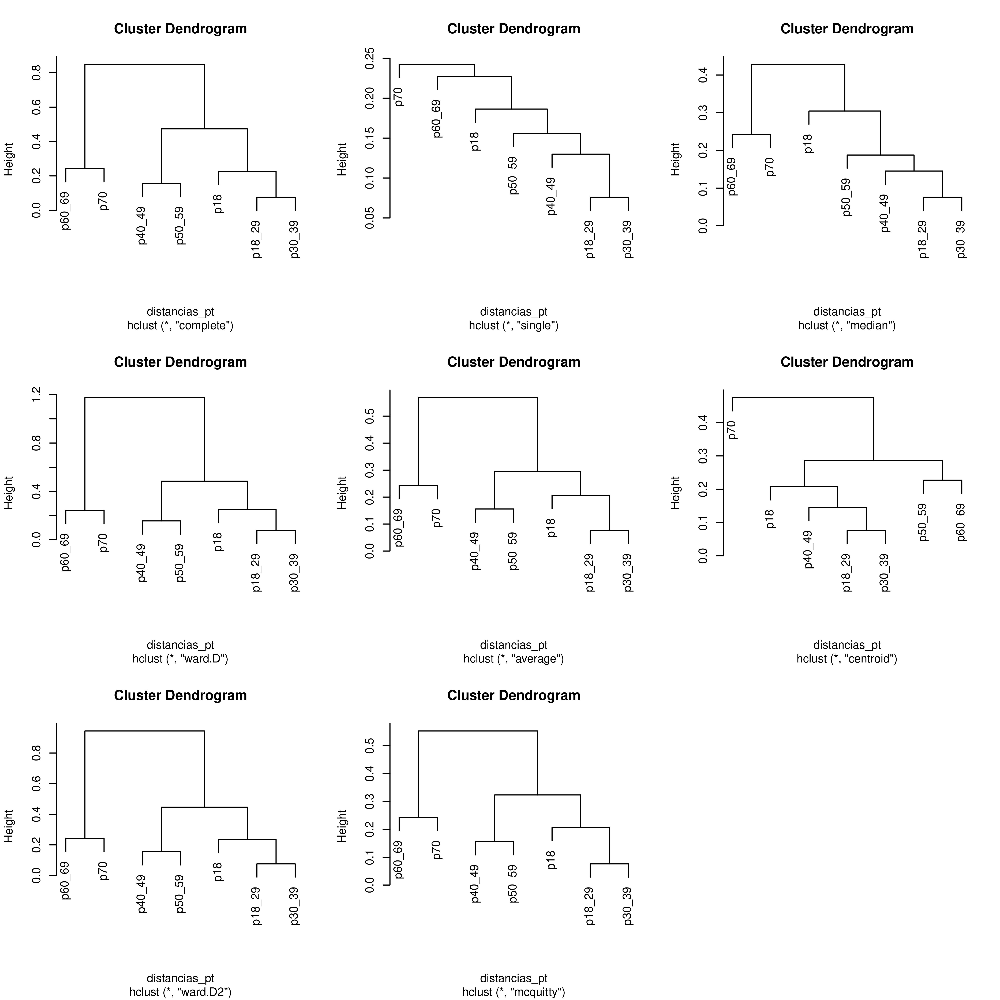
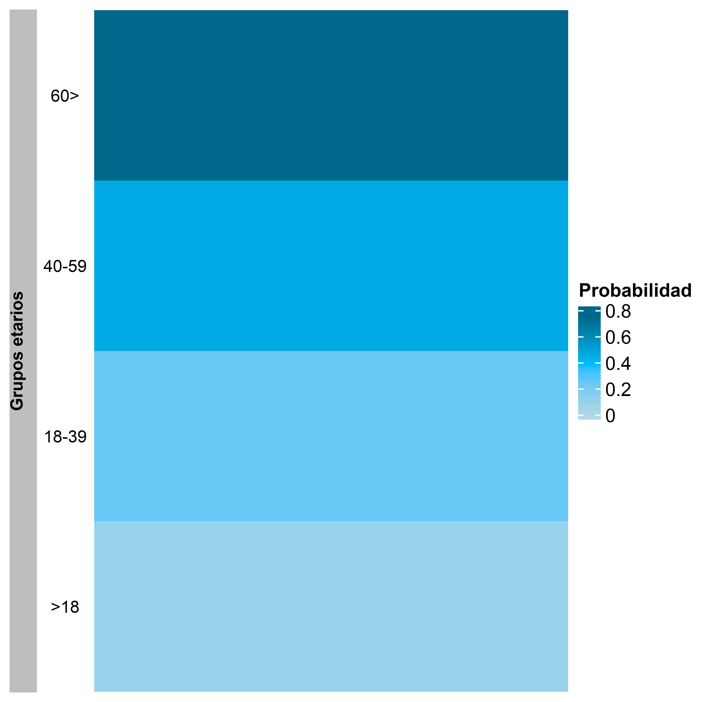
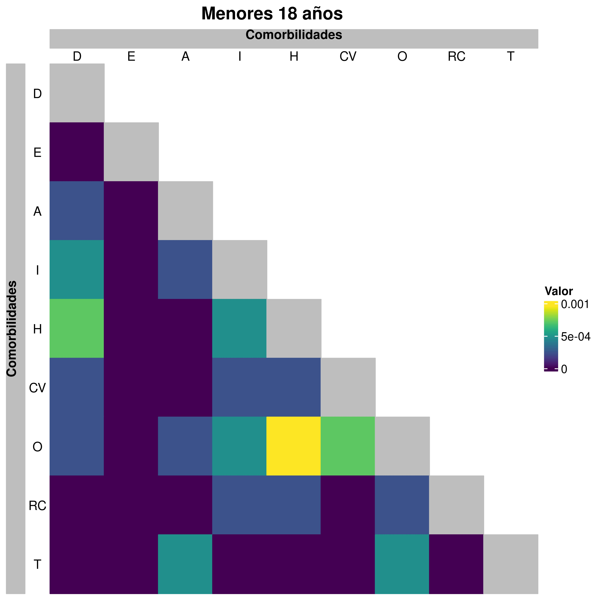
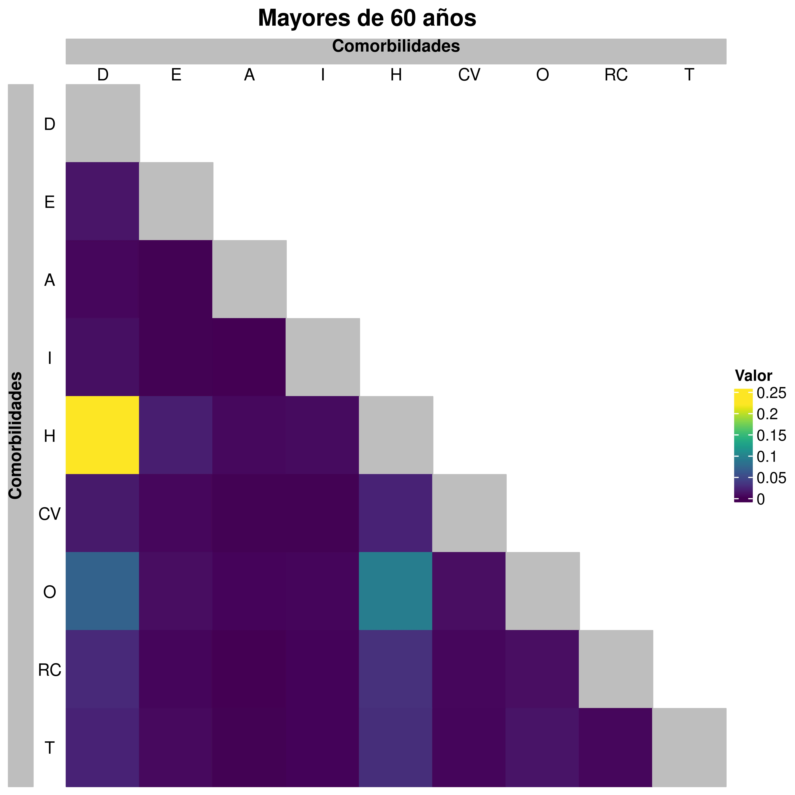
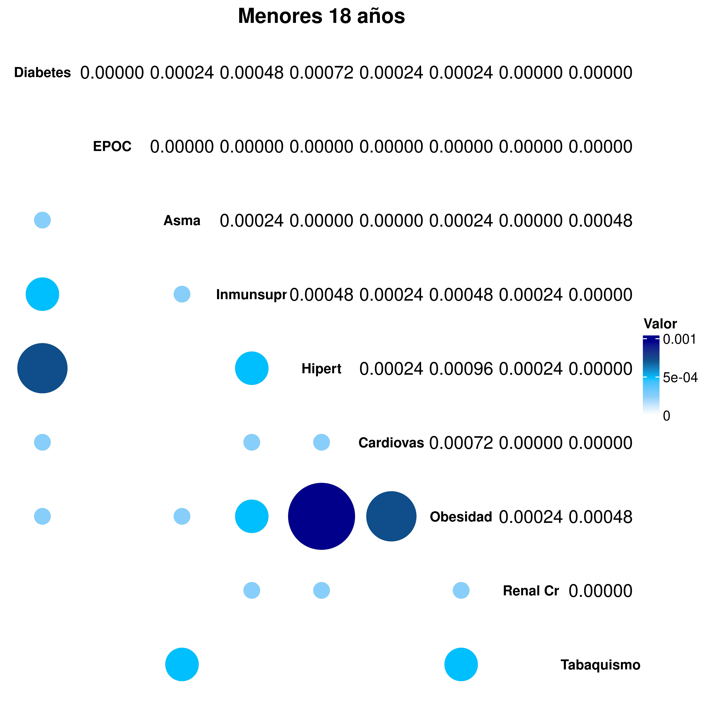
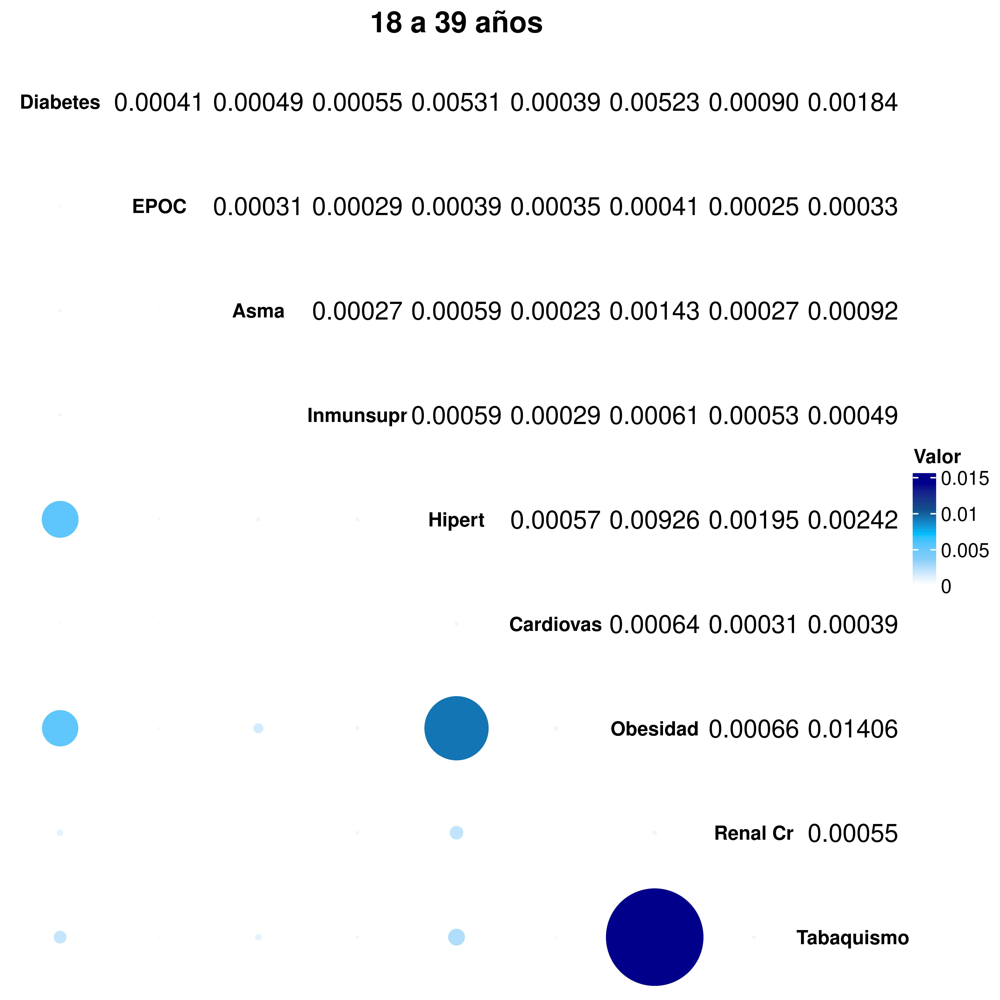
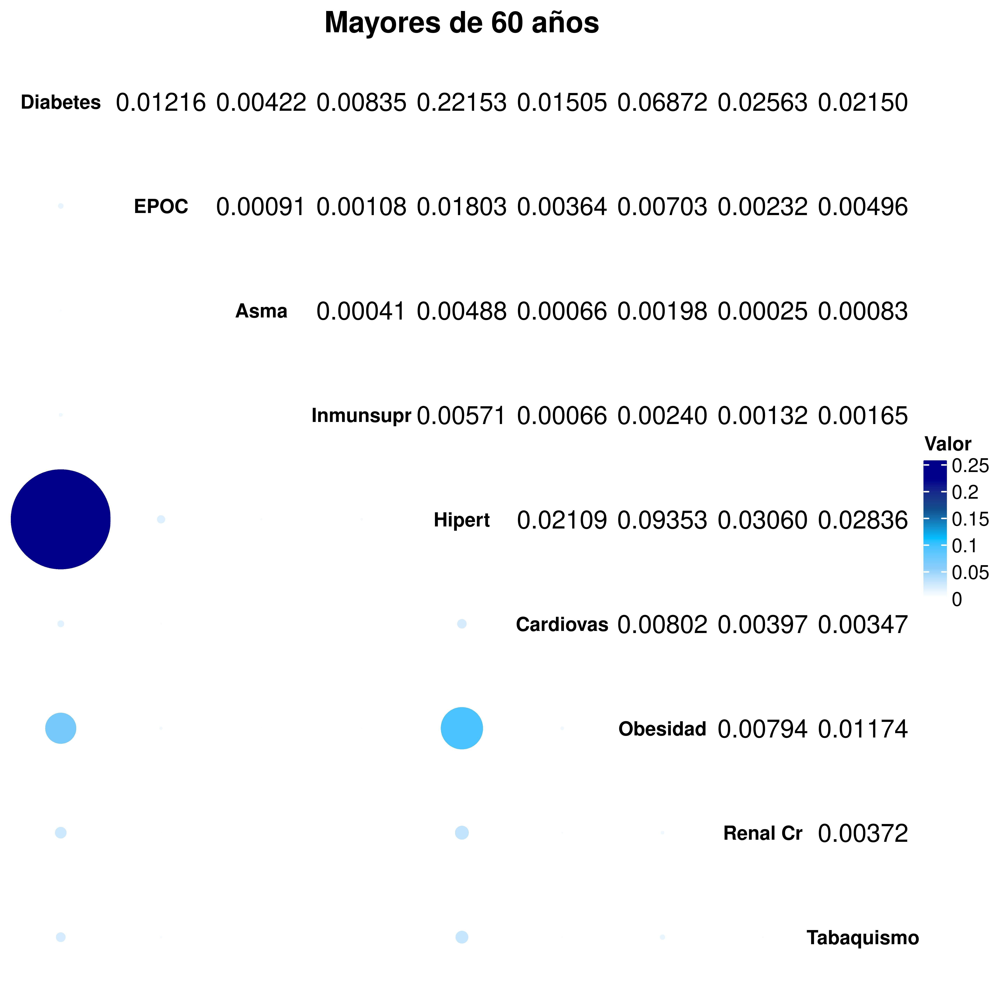
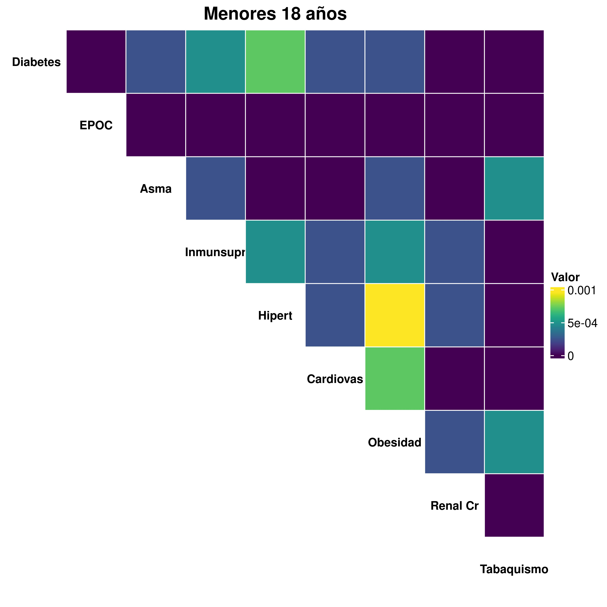
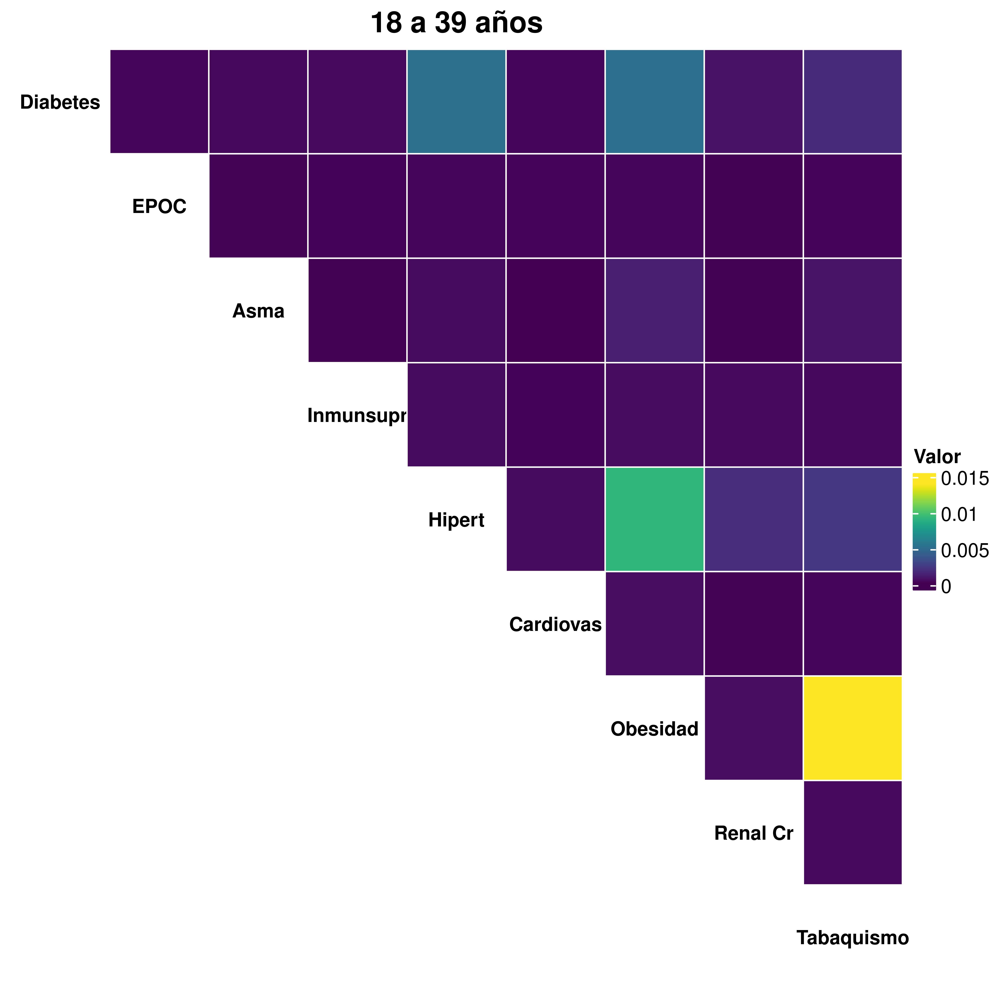

# 1. Datos

Los datos utilizados para este análisis fueron tomados de la página de la Secretaría de Salud <https://coronavirus.gob.mx/>, donde se colectaron todos los casos de COVID-19 que se registraron en el país. Para este caso, la base de datos se filtró previamente para tener exclusivamente los casos para el estado de Querétaro.

Estos casos fueron colectados desde el día 1 de enero de 2020 hasta el 18 de octubre de 2021.

# 2. Observacion inicial

Este proyecto parte al observar la grafica de casos positivos de COVID-19 para el estado de Querétaro por estructura de edad, donde se marca la observación de que los casos no son homogéneos en las edades presentadas, sino que hay más casos de ciertas edades en específico durante ciertos periodos de tiempo.

Esto pone en pie la idea de que la edad del paciente es importante para determinar la dinámica de las infecciones de COVID-19.

Además de múltiples fuentes bibliográficas.




# 3. Probabilidades de transicion

Con esta observación, se determinaron las probabilidades de transición entre estados, con base en el modelo de la CDMX. Estas probabilidades se obtuvieron por cada rango de edad de todos los casos que estan involucrados en la transición.

EStas probabilidades se determinaron como:

$$
\frac{\sum \text{todos los casos que cumplen con X}}{\sum \text{todos los casos que cumplen con y}}
$$

Con base al modelo de la CDMX, las probabilidades de transición que se podían calcular a partir de los datos, son:

- Probabilidad de ser infectado, dado que eres suceptible "**$\beta$**": 

$$p(infectado | susceptible) = \frac{\text{todos los casos positivos}}{\text{todos los casos reportados (positivos/negativos})}$$

- Probabilidad de que un infectado sea un caso ambulatorio "**$p_l$**": 

$$p(ambulatorio | infectado) = \frac{\text{todos los casos ambulatorios}}{\text{todos los casos positivos}}$$

- Probabilidad de que un infectado sea un caso grave/hospitalizado "**$p_h$**": 

$$p(hospitalizado | infectado)= \frac{\text{todos los casos hospitalizados}}{\text{todos los casos infectados}}$$
- Probabilidad de que un hospitalizado sea intubado (ICU) "**$p_i$**": 

$$p(ICU | hospitalizado) = \frac{\text{todos los casos que fueron intubados}}{todos los casos hospitalizados}$$

- Probabilidad de que unintubado muera "**$p_m$**": 

$$p(muerte | ICU) = \frac{\text{todos los casos que murieron}}{\text{todos los casos que fueron intubados}}$$

Para los casos donde se va centrando la transición, por ejemplo, de ICU a Muerte, la base de datos se filtró para contar solamente los casos, de los que fueron intubados, auqellos que murieron, sin tomar en cuenta, todas las otras muertes regitradas en la base de datos, que no fueron intubados.

```{r}
load("03_Out/OutData/probabilidades_de_transicion.RData")
probabilidades_de_transicion
```

# 4. Definición de grupos etarios

Para el estableimiento del modelo es necesario establecer las categorias de edades con base en las probabilidades de transición. Para esto, se realiza un análisis de clusterización, donde los grupos de edad se agrupan de acuerdo a la distancia entre las probabilidades de transición, es decir, para aquellas probabilidades que sean más parecidas o menos distantes, seran agrupadas en un conjunto.



Con este análisis, se obtuvieron cuatro grupos etarios por el cual se va a desarrollar el modelo:

-   **Grupo 1:** Pacientes menores de 18 años
-   **Grupo 2:** Pacientes entre 18 a 39 años
-   **Grupo 3:** Pacientes entre 40 a 59 años
-   **Grupo 4:** Pacientes entre 60 hasta mayores de 70 años

# 5. Definición del modelo

## 5.1 Diagrama por compartimentos

Este diagrama fue elaborado con base al modelo de la CDMX <https://modelo.covid19.cdmx.gob.mx/>, al cual se le modificaron los compartimentos establecidos, ya que estos fueron definidos con base a las probabilidades de transición obtenidas con los datos públicos.


## 5.2 Definición de los parámteros

+--------------+---------------------------------------------------------------+
| Parámetros   | Significado                                                   |
+==============+===============================================================+
| $\beta$      | Tasa de infección por la interacción $SI$ y $SI_l$ **Este**   |
|              | **parámetro tiene estructura de edad**                        |
+--------------+---------------------------------------------------------------+
| $\alpha$     | Tasa a la que los individuos expuestos se vuelven infectantes |
+--------------+---------------------------------------------------------------+
| $p_l$        | Fracción de individuos infectados que no son hospitalizados,  |
|              | se vuelven infectados leves $0 \le p_g \le 1$ **Este**        |
|              | **parámetro tiene estructura de edad**                        |
+--------------+---------------------------------------------------------------+
| $p_h$        | Fracción de individuos infectados que son hospitalizados      |
|              | $0 \le p_g \le 1$ **Este parámetro tiene estructura de edad** |
+--------------+---------------------------------------------------------------+
| $\delta_l$   | Tasa a la que los individuos infectados se vuelven infectados |
|              | leves/ambulatorios                                            |
+--------------+---------------------------------------------------------------+
| $\delta_h$   | Tasa a la que los individuos infectados se vuelven infectados |
|              | hospitalizados/graves                                         |
+--------------+---------------------------------------------------------------+
| $\gamma _R$  | Tasa en la que los individuos infectados leves se recuperan   |
+--------------+---------------------------------------------------------------+
| $p_i$        | Fracción de individuos hospitalizados que son intubados       |
|              | $0 \le p_i \le 1$ **Este parámetro tiene estructura de edad** |
+--------------+---------------------------------------------------------------+
| $(1-p_i)$    | Resto de individuos hospitalizados que no son intubados,      |
|              | se recuperan                                                  |
+--------------+---------------------------------------------------------------+
| $\gamma _h$  | Tasa a la que los individuos hospitalizados se recuperan      |
+--------------+---------------------------------------------------------------+
| $\delta _i$  | Tasa a la que los individuos hospitalizados son intubados     |
+--------------+---------------------------------------------------------------+
| $\mu$        | Fracción de individuos intubados que mueren $0 \le \mu \le 1$ |
|              | **Este parámetro tiene estructura de edad**                   |
+--------------+---------------------------------------------------------------+
| $(1-\mu)$    | Resto de individuos intubados que no mueren, se recuperan     |
+--------------+---------------------------------------------------------------+
| $\delta _m$  | Tasa a la que los individuos intubados mueren                 |
+--------------+---------------------------------------------------------------+
| $\gamma _i$  | Tasa a la que los individuos intubados se recuperan           |
+--------------+---------------------------------------------------------------+

### 5.2.1 Valor de los parámetros

+-------------+------------+
| Parámetros  | Valor      |
+=============+============+
| $\beta _1$  | 0.3771645  |
+-------------+------------+
| $\beta _2$  | 0.4473864  |
+-------------+------------+
| $\beta _3$  | 0.5090940  |
+-------------+------------+
| $\beta _4$  | 0.5638485  |
+-------------+------------+
|             |            |
+-------------+------------+
| $\alpha$    | 1/Dincub   |
+-------------+------------+
|             |            |
+-------------+------------+
| $p _{l1}$   | 0.9746533  |
+-------------+------------+
| $p _{l2}$   | 0.9610823  |
+-------------+------------+
| $p _{l3}$   | 0.8420886  |
+-------------+------------+
| $p _{l4}$   | 0.5567019  |
+-------------+------------+
|             |            |
+-------------+------------+
| $p _{h1}$   | 0.02534672 |
+-------------+------------+
| $p _{h2}$   | 0.03891768 |
+-------------+------------+
| $p _{h3}$   | 0.15791136 |
+-------------+------------+
| $p _{h4}$   | 0.44329812 |
+-------------+------------+
|             |            |
+-------------+------------+
| $\delta _l$ | 1/Dinfect  |
+-------------+------------+
|             |            |
+-------------+------------+
| $\delta _h$ | 1/Dhosp    |
+-------------+------------+
|             |            |
+-------------+------------+
| $\gamma _R$ | 1/DRL      |
+-------------+------------+
|             |            |
+-------------+------------+
| $p_{i1}$    | 0.09433962 |
+-------------+------------+
| $p_{i2}$    | 0.11152620 |
+-------------+------------+
| $p_{i3}$    | 0.18827911 |
+-------------+------------+
| $p_{i4}$    | 0.21197680 |
+-------------+------------+
|             |            |
+-------------+------------+
| $\delta _i$ | 1/DICU     |
+-------------+------------+
|             |            |
+-------------+------------+
| $\gamma _h$ | 1/DRH      |
+-------------+------------+
|             |            |
+-------------+------------+
| $\mu _1$    | 0.5000000  |
+-------------+------------+
| $\mu _2$    | 0.6896226  |
+-------------+------------+
| $\mu _3$    | 0.8224699  |
+-------------+------------+
| $\mu _4$    | 0.8972645  |
+-------------+------------+
|             |            |
+-------------+------------+
| $\delta _m$ | 1/DM       |
+-------------+------------+
|             |            |
+-------------+------------+
| $\gamma _i$ | 1/DRICU    |
+-------------+------------+

### 5.2.2 Parámetros adicionales

+-----------+-------+----------------------------------------------------------+
| Parámetro | Valor | Significado                                              |
+===========+=======+==========================================================+
| Dincub    | 5.6   | Tiempo de incubación (dias) (Quesada et al., 2021        |
|           |       | DOI: 10.1016/j.rceng.2020.08.002)                        |
+-----------+-------+----------------------------------------------------------+
| Dinfect   | 5.5   | Tiempo en el que es infeccioso el paciente (Xin et al.,  |
|           |       | 2021 <https://doi.org/10.1093/cid/ciab746>)              |
+-----------+-------+----------------------------------------------------------+
| DRL       | 14    | Tiempo de recuperacion de casos leves (dias) (Se         |
|           |       | mantiene de diversas fuentes )                           |
+-----------+-------+----------------------------------------------------------+
| Dhosp     | 4     | Tiempo entre presencia de sintomas y hospitalización en  |
|           |       | casos graves (dias)                                      |
+-----------+-------+----------------------------------------------------------+
| DRH       | 12    | Tiempo entre hospitalizacion de casos gravez no UCI y    |
|           |       | recuperacion (dias)                                      |
+-----------+-------+----------------------------------------------------------+
| DM        | 8     | Tiempo entre ingreso a UCI y deceso                      |
+-----------+-------+----------------------------------------------------------+
| DRICU     | 7     | Tiempo entre ingreso a UCI y recuperación (dias)         |
+-----------+-------+----------------------------------------------------------+
| DICU      | 1     | Tiempo entre ingreso a hospitalización e ingreso a UCI   |
+-----------+-------+----------------------------------------------------------+

### 5.2.3 Comparación de Parámetros

+----------+-----------------------------------------+-------------------+--------------------+
| Variable | Elementos de las ecuaciones             |                   |                    |
+==========+=========================================+===================+====================+
| $S_1$    | $- 0.3771 S_1 (I_1 + I_2+ I_3 + I_4)$   |                   |                    |
+----------+-----------------------------------------+-------------------+--------------------+
| $E_1$    | $0.3771 S_1 (I_1 + I_2+ I_3 + I_4)$     | $-0.1785 E_1$     |                    |
+----------+-----------------------------------------+-------------------+--------------------+
| $I_1$    | $0.1785 E_1$                            | $-0.006325 I_1$   | $-0.1772 I_1$      |
+----------+-----------------------------------------+-------------------+--------------------+
| $I_{l1}$ | $0.1772 I_1$                            | $-0.0714 I_{l1}$  |                    |
+----------+-----------------------------------------+-------------------+--------------------+
| $I_{h1}$ | $0.006325 I_1$                          | $-0.0943 I_{h1}$  | $-0.0754 I_{h1}$   |
+----------+-----------------------------------------+-------------------+--------------------+
| $I_{i1}$ | $0.0943 I_{h1}$                         | $-0.0625 I_{i1}$  | $-0.0714 I_{i1}$   |
+----------+-----------------------------------------+-------------------+--------------------+
| $M_1$    | $0.0625 I_{i1}$                         |                   |                    |
+----------+-----------------------------------------+-------------------+--------------------+
| $R_1$    | $0.0714 I_{l1}$                         | $+0.0754 I_{h1}$  | $+0.0714 I_{i1}$   |
+----------+-----------------------------------------+-------------------+--------------------+
| \        |                                         |                   |                    |
+----------+-----------------------------------------+-------------------+--------------------+
| $S_2$    | $- 0.4473 S_2 (I_1 + I_2+ I_3 + I_4)$   |                   |                    |
+----------+-----------------------------------------+-------------------+--------------------+
| $E_2$    | $0.4473 S_2 (I_1 + I_2+ I_3 + I_4)$     | $-0.1785 E_2$     |                    |
+----------+-----------------------------------------+-------------------+--------------------+
| $I_2$    | $0.1785 E_2$                            | $-0.009725 I_2$   | $-0.1747 I_2$      |
+----------+-----------------------------------------+-------------------+--------------------+
| $I_{l2}$ | $0.1747 I_2$                            | $-0.0714 I_{l2}$  |                    |
+----------+-----------------------------------------+-------------------+--------------------+
| $I_{h2}$ | $0.009725 I_2$                          | $-0.1115 I_{h2}$  | $-0.0740 I_{h2}$   |
+----------+-----------------------------------------+-------------------+--------------------+
| $I_{i2}$ | $0.1115 I_{h2}$                         | $-0.0862 I_{i2}$  | $-0.0443 I_{i2}$   |
+----------+-----------------------------------------+-------------------+--------------------+
| $M_2$    | $0.0862 I_{i2}$                         |                   |                    |
+----------+-----------------------------------------+-------------------+--------------------+
| $R_2$    | $0.0714 I_{l2}$                         | $+0.0740 I_{h2}$  | $+0.0443 I_{i2}$   |
+----------+-----------------------------------------+-------------------+--------------------+
| \        |                                         |                   |                    |
+----------+-----------------------------------------+-------------------+--------------------+
| $S_3$    | $-0.5090 S_3 (I_1 + I_2+ I_3 + I_4)$    |                   |                    |
+----------+-----------------------------------------+-------------------+--------------------+
| $E_3$    | $0.5090 S_3 (I_1 + I_2+ I_3 + I_4)$     | $-0.1785 E_3$     |                    |
+----------+-----------------------------------------+-------------------+--------------------+
| $I_3$    | $0.1785 E_3$                            | $-0.0394 I_3$     | $-0.1530 I_3$      |
+----------+-----------------------------------------+-------------------+--------------------+
| $I_{l3}$ | $0.1530 I_3$                            | $-0.0714 I_{l3}$  |                    |
+----------+-----------------------------------------+-------------------+--------------------+
| $I_{h3}$ | $0.0394 I_3$                            | $-0.1882 I_{h3}$  | $-0.0676 I_{h3}$   |
+----------+-----------------------------------------+-------------------+--------------------+
| $I_{i3}$ | $0.1882 I_{h3}$                         | $-0.1028 I_{i3}$  | $-0.0253 I_{i3}$   |
+----------+-----------------------------------------+-------------------+--------------------+
| $M_3$    | $0.1028 I_{i3}$                         |                   |                    |
+----------+-----------------------------------------+-------------------+--------------------+
| $R_3$    | $0.0714 I_{l3}$                         | $+0.0676 I_{h3}$  | $+0.0253 I_{i3}$   |
+----------+-----------------------------------------+-------------------+--------------------+
| \        |                                         |                   |                    |
+----------+-----------------------------------------+-------------------+--------------------+
| $S_4$    | $- 0.5638 S_4 (I_1 + I_2+ I_3 + I_4)$   |                   |                    |
+----------+-----------------------------------------+-------------------+--------------------+
| $E_4$    | $0.5638 S_4 (I_1 + I_2+ I_3 + I_4)$     | $-0.1785 E_4$     |                    |
+----------+-----------------------------------------+-------------------+--------------------+
| $I_4$    | $0.1785 E_4$                            | $-0.1108 I_4$     | $-1012 I_4$        |
+----------+-----------------------------------------+-------------------+--------------------+
| $I_{l4}$ | $1012 I_4$                              | $-0.0714 I_{l4}$  |                    |
+----------+-----------------------------------------+-------------------+--------------------+
| $I_{h4}$ | $0.1108 I_4$                            | $-0.2119 I_{h4}$  | $-0.0656 I_{h4}$   |
+----------+-----------------------------------------+-------------------+--------------------+
| $I_{i4}$ | $0.2119 I_{h4}$                         | $-0.1121 I_{i4}$  | $-0.01468 I_{i4}$  |
+----------+-----------------------------------------+-------------------+--------------------+
| $M_4$    | $0.1121 I_{i4}$                         |                   |                    |
+----------+-----------------------------------------+-------------------+--------------------+
| $R_4$    | $0.0714 I_{l4}$                         | $0.0656 I_{h4}$   | $0.01468 I_{i4}$   |
+----------+-----------------------------------------+-------------------+--------------------+


## 5.3 Variables

**Grupo 1**

-   $S_1$ : individuos suceptibles del grupo 1
-   $E_1$ : individuos expuestos infectados pero no infectantes del grupo 1
-   $I_1$ : individuos infectados que son infectantes del grupo 1
-   $I_{l1}$ : individuos infectados leves del grupo 1
-   $I_{h1}$ : individuos infectados hospitalizados del grupo 1
-   $I_{i1}$ : individuos infectados intubados del grupo 1
-   $R_1$ : individuos recuperados del grupo 1
-   $M_1$ : individuos muertos del grupo 1

**Grupo 2**

-   $S_2$ : individuos suceptibles del grupo 2
-   $E_2$ : individuos expuestos infectados pero no infectantes del grupo 2
-   $I_2$ : individuos infectados que son infectantes del grupo 2
-   $I_{l2}$ : individuos infectados leves del grupo 2
-   $I_{h2}$ : individuos infectados hospitalizados del grupo 2
-   $I_{i2}$ : individuos infectados intubados del grupo 2
-   $R_2$ : individuos recuperados del grupo 2
-   $M_2$ : individuos muertos del grupo 2

**Grupo 3**

-   $S_3$ : individuos suceptibles del grupo 3
-   $E_3$ : individuos expuestos infectados pero no infectantes del grupo 3
-   $I_3$ : individuos infectados que son infectantes del grupo 3
-   $I_{l3}$ : individuos infectados leves del grupo 3
-   $I_{h3}$ : individuos infectados hospitalizados del grupo 3
-   $I_{i3}$ : individuos infectados intubados del grupo 3
-   $R_3$ : individuos recuperados del grupo 3
-   $M_3$ : individuos muertos del grupo 3

**Grupo 4**

-   $S_4$ : individuos suceptibles del grupo 4
-   $E_4$ : individuos expuestos infectados pero no infectantes del grupo 4
-   $I_4$ : individuos infectados que son infectantes del grupo 4
-   $I_{l4}$ : individuos infectados leves del grupo 4
-   $I_{h4}$ : individuos infectados hospitalizados del grupo 4
-   $I_{i4}$ : individuos infectados intubados del grupo 4
-   $R_4$ : individuos recuperados del grupo 4
-   $M_4$ : individuos muertos del grupo 4

## 5.4 Ecuaciones

$$\begin{array}{l}
\text{Para el grupo 1 :} \\
\dot S_1 = - \frac{\beta_1}{N} * S_1 (I_1 + I_2+ I_3 + I_4)  \\
\dot E_1 = \frac{\beta_1}{N} * S_1 (I_1 + I_2+ I_3 + I_4) - \alpha E_1 \\
\dot I_1 = \alpha E_1 - p_{h1} \delta _h I_1 - p_{l1} \delta _l I_1 \\
\dot I_{l1} = p_{l1} \delta _l I_1 - \gamma _R I_{l1} \\
\dot I_{h1} = p_{h1} \delta _h I_1 - p_{i1} \delta _{i} I_{h1} - (1 - p_{i1}) \gamma _h I_{h1} \\
\dot I_{i1} = p_{i1} \delta _i I_{h1} - \mu _1 \delta _\mu I_{i1} - (1 - \mu _1) \gamma _i I_{i1} \\
\dot M_1 = \mu _1 \delta _\mu I_{i1} \\
\dot R_1 = \gamma _R I_{l1} + (1 - p_{i1}) \gamma _h I_{h1} + (1 - \mu _1) \gamma _i I_{i1}
\\
\\
\text{Para el grupo 2 :} \\
\dot S_2 = - \frac{\beta_2}{N} * S_2 (I_1 + I_2+ I_3 + I_4)  \\
\dot E_2 = \frac{\beta_2}{N} * S_2 (I_1 + I_2+ I_3 + I_4) - \alpha E_2 \\
\dot I_2 = \alpha E_2 - p_{h2} \delta _h I_2 - p_{l2} \delta _l I_2 \\
\dot I_{l2} = p_{l2} \delta _l I_2 - \gamma _R I_{l2} \\
\dot I_{h2} = p_{h2} \delta _h I_2 - p_{i2} \delta _{i} I_{h2} - (1 - p_{i2}) \gamma _h I_{h2} \\
\dot I_{i2} = p_{i2} \delta _i I_{h2} - \mu _2 \delta _\mu I_{i2} - (1 - \mu _2) \gamma _i I_{i2} \\
\dot M_2 = \mu _2 \delta _\mu I_{i2} \\
\dot R_2 = \gamma _R I_{l2} + (1 - p_{i2}) \gamma _h I_{h2} + (1 - \mu _2) \gamma _i I_{i2}
\\
\\
\text{Para el grupo 3 :} \\
\dot S_3 = - \frac{\beta_3}{N} * S_3 (I_1 + I_2+ I_3 + I_4)  \\
\dot E_3 = \frac{\beta_3}{N} * S_3 (I_1 + I_2+ I_3 + I_4) - \alpha E_3 \\
\dot I_3 = \alpha E_3 - p_{h3} \delta _h I_3 - p_{l3} \delta _l I_3 \\
\dot I_{l3} = p_{l3} \delta _l I_3 - \gamma _R I_{l3} \\
\dot I_{h3} = p_{h3} \delta _h I_3 - p_{i3} \delta _{i} I_{h3} - (1 - p_{i3}) \gamma _h I_{h3} \\
\dot I_{i3} = p_{i3} \delta _i I_{h3} - \mu _3 \delta _\mu I_{i3} - (1 - \mu _3) \gamma _i I_{i3} \\
\dot M_3 = \mu _3 \delta _\mu I_{i3} \\
\dot R_3 = \gamma _R I_{l3} + (1 - p_{i3}) \gamma _h I_{h3} + (1 - \mu _3) \gamma _i I_{i3}
\\
\\
\text{Para el grupo 4 :} \\
\dot S_4 = - \frac{\beta_4}{N} * S_4 (I_1 + I_2+ I_3 + I_4)  \\
\dot E_4 = \frac{\beta_4}{N} * S_4 (I_1 + I_2+ I_3 + I_4) - \alpha E_4 \\
\dot I_4 = \alpha E_4 - p_{h4} \delta _h I_4 - p_{l4} \delta _l I_4 \\
\dot I_{l4} = p_{l4} \delta _l I_4 - \gamma _R I_{l4} \\
\dot I_{h4} = p_{h4} \delta _h I_4 - p_{i4} \delta _{i} I_{h4} - (1 - p_{i4}) \gamma _h I_{h4} \\
\dot I_{i4} = p_{i4} \delta _i I_{h4} - \mu _4 \delta _\mu I_{i4} - (1 - \mu _4) \gamma _i I_{i4} \\
\dot M_4 = \mu _4 \delta _\mu I_{i4} \\
\dot R_4 = \gamma _R I_{l4} + (1 - p_{i4}) \gamma _h I_{h4} + (1 - \mu _4) \gamma _i I_{i4}
\end{array}$$


### 5.4.1 Población conservada

Para demostrar que la población se conserva, se asume que:

$$N = S + E + I + I_l + I_h + I_i + M + R = 1$$

Esto siendo aplicable a todos los casos en la estructura etaria, por lo que:

$$\dot N = \dot S + \dot E + \dot I + \dot I_l + \dot I_h + \dot I_i + \dot M + \dot R = 0$$

De manera que, integrando a las ecuaciones, quedaría como:

$$\begin{array}{l}
\dot N = - \beta_n S_n (\sum I_n) + \\ 
\beta_n S_n (\sum I_n) - \alpha E_n + \alpha E_n \\
- p_{hn} \delta_{h} I_n - p_{ln} \delta _l I_{n} + p_{ln} \delta _l I_{n} \\
- \gamma _R I_{ln} + p_{hn} \delta_{h} I_n - p_{in} \delta _i I_{hn} \\
- (1-p_{in}) \gamma _h I_{hn} + p_{in} \delta _i I_{hn} \\
- \mu _n \delta _\mu I_{in} - (1-\mu_n) \gamma_i I_{in} \\
+ \mu _n \delta _\mu I_{in} + \gamma _R I_{ln} + (1-p_{in}) \gamma _h I_{hn} \\
+ (1-\mu_n) \gamma_i I_{in} = 0
\end{array}$$

## 5.5 Condiciones iniciales del sistema

De acuerdo a la información obtenida del INEGI, la población del estado de  Querétaro es de 2,368,467 habitantes, al [senso realizado en 2020](https://cuentame.inegi.org.mx/monografias/informacion/queret/poblacion/default.aspx?tema). Este valor de la poblacion se toma como el valor total de la población. Para el caso de cada estructura de edad definia, la población de individuos suceptibles quedaria como:

+ Grupo 1: Menores de 18 años = 782000
+ Grupo 2: 18 - 39 años = 801000
+ Grupo 3: 40 - 59 años = 539000
+ Grupo 4: 60 - >70 años = 242000

# 6 Resolución numérica del modelo

## 6.1 Modelo con grupos completos

El modelo de COVID para el estado de Querétaro se resolvió en R con el uso de [deSolve](https://cran.r-project.org/web/packages/deSolve/index.html). 

```
## Funcion del modelo ====
modelo_covid_all_groups <- function(t, state, parameters){
    with(as.list(c(state, parameters)), {
        
        ## GRUPO 1
        dS1   <- - (beta_1/(N1+N2+N3+N4)) * S1 * (I1 + I2 + I3 + I4)
        dE1   <- ( (beta_1/(N1+N2+N3+N4)) * S1 * (I1 + I2 + I3 + I4) ) - ( alpha * E1 )
        dI1   <- ( alpha * E1 ) - ( ph_1 * delta_h * I1 ) - ( pl_1 * delta_l * I1 )
        dI_l1 <- ( pl_1 * delta_l * I1 ) - ( gamma_R * I_l1 )
        dI_h1 <- ( ph_1 * delta_h * I1 ) - ( pi_1 * delta_i * I_h1 ) - ( (1 - pi_1) * gamma_h * I_h1 )
        dI_i1 <- ( pi_1 * delta_i * I_h1 ) - ( mu_1 * delta_m * I_i1 ) - ( (1 - mu_1) * gamma_i * I_i1 )
        dM1   <-  mu_1 * delta_m * I_i1
        dR1   <- ( gamma_R * I_l1 ) + ( (1 - pi_1) * gamma_h * I_h1 ) + ( (1 - mu_1) * gamma_i * I_i1 )
        
        
        
        ## GRUPO 2
        dS2   <- - (beta_2/(N1+N2+N3+N4)) * S2 * (I1 + I2 + I3 + I4)
        dE2   <- ( (beta_2/(N1+N2+N3+N4)) * S2 * (I1 + I2 + I3 + I4) ) - ( alpha * E2 )
        dI2   <- ( alpha * E2 ) - ( ph_2 * delta_h * I2 ) - ( pl_2 * delta_l * I2 )
        dI_l2 <- ( pl_2 * delta_l * I2 ) - ( gamma_R * I_l2 )
        dI_h2 <- ( ph_2 * delta_h * I2 ) - ( pi_2 * delta_i * I_h2 ) - ( (1 - pi_2) * gamma_h * I_h2 )
        dI_i2 <- ( pi_2 * delta_i * I_h2 ) - ( mu_2 * delta_m * I_i2 ) - ( (1 - mu_2) * gamma_i * I_i2 )
        dM2   <-  mu_2 * delta_m * I_i2
        dR2   <- ( gamma_R * I_l2 ) + ( (1 - pi_2) * gamma_h * I_h2 ) + ( (1 - mu_2) * gamma_i * I_i2 )
        
        
        
        ## GRUPO 3
        dS3   <- - (beta_3/(N1+N2+N3+N4)) * S3 * (I1 + I2 + I3 + I4)
        dE3   <- ( (beta_3/(N1+N2+N3+N4)) * S3 * (I1 + I2 + I3 + I4) ) - ( alpha * E3 )
        dI3   <- ( alpha * E3 ) - ( ph_3 * delta_h * I3 ) - ( pl_3 * delta_l * I3 )
        dI_l3 <- ( pl_3 * delta_l * I3 ) - ( gamma_R * I_l3 )
        dI_h3 <- ( ph_3 * delta_h * I3 ) - ( pi_3 * delta_i * I_h3 ) - ( (1 - pi_3) * gamma_h * I_h3 )
        dI_i3 <- ( pi_3 * delta_i * I_h3 ) - ( mu_3 * delta_m * I_i3 ) - ( (1 - mu_3) * gamma_i * I_i3 )
        dM3   <-  mu_3 * delta_m * I_i3
        dR3   <- ( gamma_R * I_l3 ) + ( (1 - pi_3) * gamma_h * I_h3 ) + ( (1 - mu_3) * gamma_i * I_i3 )
        
        
        
        ## GRUPO 4
        dS4   <- - (beta_4/(N1+N2+N3+N4)) * S4 * (I1 + I2 + I3 + I4)
        dE4   <- ( (beta_4/(N1+N2+N3+N4)) * S4 * (I1 + I2 + I3 + I4) ) - ( alpha * E4 )
        dI4   <- ( alpha * E4 ) - ( ph_4 * delta_h * I4 ) - ( pl_4 * delta_l * I4 )
        dI_l4 <- ( pl_4 * delta_l * I4 ) - ( gamma_R * I_l4 )
        dI_h4 <- ( ph_4 * delta_h * I4 ) - ( pi_4 * delta_i * I_h4 ) - ( (1 - pi_4) * gamma_h * I_h4 )
        dI_i4 <- ( pi_4 * delta_i * I_h4 ) - ( mu_4 * delta_m * I_i4 ) - ( (1 - mu_4) * gamma_i * I_i4 )
        dM4   <-  mu_4 * delta_m * I_i4
        dR4   <- ( gamma_R * I_l4 ) + ( (1 - pi_4) * gamma_h * I_h4 ) + ( (1 - mu_4) * gamma_i * I_i4 )
        
        
        
        list(c(dS1, dE1, dI1, dI_l1, dI_h1, dI_i1, dM1, dR1,
               dS2, dE2, dI2, dI_l2, dI_h2, dI_i2, dM2, dR2,
               dS3, dE3, dI3, dI_l3, dI_h3, dI_i3, dM3, dR3,
               dS4, dE4, dI4, dI_l4, dI_h4, dI_i4, dM4, dR4))
        
    })
}

## Tiempo ====

t <- seq (0, 300, by = 0.1)

## Parametros ====

parameters <- c(
    
    beta_1  <- 0.3771645     ,
    beta_2  <- 0.4473864     ,
    beta_3  <- 0.5090940     ,
    beta_4  <- 0.5638485     ,
    
    
    alpha   <- 1/5.6         ,
    
    pl_1    <- 0.9746533     ,
    pl_2    <- 0.9610823     ,
    pl_3    <- 0.8420886     ,
    pl_4    <- 0.5567019     ,
    
    ph_1    <- 0.02534672    ,
    ph_2    <- 0.03891768    ,
    ph_3    <- 0.15791136    ,
    ph_4    <- 0.44329812    ,
    
    delta_l <- 1/5.5         ,
    
    delta_h <- 1/4           ,
    
    gamma_R <- 1/14          ,
    
    pi_1    <- 0.09433962    ,
    pi_2    <- 0.11152620    ,
    pi_3    <- 0.18827911    ,
    pi_4    <- 0.21197680    ,
    
    delta_i <- 1/1           ,
    
    gamma_h <- 1/12          ,
    
    mu_1    <- 0.5000000     ,
    mu_2    <- 0.6896226     ,
    mu_3    <- 0.8224699     ,
    mu_4    <- 0.8972645     ,
    
    delta_m <- 1/8           ,
    
    gamma_i <- 1/7           ,
    
    N1       <- 782000       ,
    N2       <- 801000       ,
    N3       <- 539000       ,
    N4       <- 242000       
    
)

## Condiciones iniciales del sistema ====
# De acuerdo a la información obtenida del INEGI, la población del estado de 
# Querétaro es de 2,368,467 habitantes, al senso realizado en 2020. 
# Este valor de la poblacion se toma como el valor total de la población.
# Para el caso de cada estructura de edad definia, la población de individuos 
# suceptibles quedaria como:
#        Grupo 1: Menores de 18 años = 782000
#        Grupo 2: 18 - 39 años = 801000
#        Grupo 3: 40 - 59 años = 539000
#        Grupo 4: 60 - >70 años = 242000

state <- c(
    
    ## GRUPO 1
    S1    = N1 - 1,
    E1    = 0,
    I1    = 1,
    I_l1  = 0,
    I_h1  = 0,
    I_i1  = 0,
    M1    = 0,
    R1    = 0,
    
    
    
    ## GRUPO 2
    S2    = N2 - 1,
    E2    = 0,
    I2    = 1,
    I_l2  = 0,
    I_h2  = 0,
    I_i2  = 0,
    M2    = 0,
    R2    = 0,
    
    ## GRUPO 3
    S3    = N3 - 1,
    E3    = 0,
    I3    = 1,
    I_l3  = 0,
    I_h3  = 0,
    I_i3  = 0,
    M3    = 0,
    R3    = 0,
    
    
    
    ## GRUPO 4
    S4    = N4 - 1,
    E4    = 0,
    I4    = 1,
    I_l4  = 0,
    I_h4  = 0,
    I_i4  = 0,
    M4    = 0,
    R4    = 0
)

## Out ====
out_all_groups <- as.data.frame(ode(y     = state, 
                         times = t, 
                         func   = modelo_covid_all_groups,
                         parms = parameters))
```

```{r message=FALSE, warning=FALSE}
library(plotly)
source("02_Scripts/06_Resolucion_numerica.R")
ggplotly(grafica_all_groups)
```

## 6.2 Gráficas suplementarias

### 6.2.1 Gráfica de infectados 

```{r message=FALSE, warning=FALSE}
source("02_Scripts/07_Graficas_del_modelo.R")
ggplotly(grafica_infectados)
```

### 6.2.2 Grafica de Recuperados

```{r}
ggplotly(grafica_recuperados)
```

### 6.2.3 Gráfica de muertos

```{r}
ggplotly(grafica_muertos)
```

# 7. Cálculo de probabilidades condicionales

¿Por qué no considerar comorbilidades? R= ¿Cuál es la probabilidad que una persona de cierta edad tenga una comorbilidad, dos, tres , cuatro o combinaciones de éstas? La probabilidad de que dado que tiene una comorbilidad, a qué categoría es más probable que pertenezca $p(cat_j|com_i) = \frac{\text{# casos de comorbilidad }j\text{ en la categoría }i}{\text{#casos de la categoría }i}$.

## 7.1 Conteo de comorbilidades

Se hicieron los conteos por cada categoría de cuántos pácientes tienen alguna comorbilidad. Se hace por cada categoría y en cada comorbilidad. Se hace uso de una función alojada en R.

```{r}
load("03_Out/OutData/conteo_comorbilidades.RData")
comorbilidades_conteos
```

Una vez se obtuvo el conteo de las comorbilidades, se hizo el conteo de todos los casos positivos registrados para obtener el total de casos por cada categoría.

## 7.2 Determinación de p(com_j & cat_i)

Para obtener la probabilidad, se dividen los casos de comorbilidad por cada una, entre el total de casos de cada categoría. Los datos se guardaron en una matriz.

```{r}
load("03_Out/OutData/matriz_2_p_comorbilidades.RData")
matriz_comor
```

## 7.3 Visualización de datos

Los datos se visualizaron en una matriz, utilizando el paquete *ComplexHetmap*.


## 7.4 Probabilidad de que tengas al menos una comorbilidad

Para esto, se hace el conteo de casos que tengan al menos una comorbilidad, por cada categoría de edad. Los conteos se dividieron entre el número de casos positivos registrados para esa categoría. POsteriormente, los datos se normalizaron. Los datos procesados se visualizan como un heatmap. 




# 8. Determinación de probabilidades condiconales con combinación de comorbilidades

¿Cuál es la probabilidad que una persona de cierta edad tenga combinaciones de dos comorbilidades? La probabilidad de que dado que tiene dos comorbilidad, a qué categoría es más probable que pertenezca. $p(cat_i|com_j\&com_k)=\frac{\sum\text{casos de combinación de dos comorbilidades de la cat}_i}{\sum\text{casos de la cat}_i}$

## 8.1 Conteo de casos con combinaciones de comorbilidades

De los casos positivos, se hizo el conteo de los casos que tienen combinaciones de 9 comorbilidades, entre cada una de ellas. Se generaron cuatro matrices de 9x9 de cada categoría con los conteos de cada combinación de comorbilidades. Se hizo uso de una función generada en R.

```{r}
source("02_Scripts/10_calculo_de_probabilidades_condicionales_con_combinacion_de_comorbilidades.R")
conteo_comor_combinated_1
conteo_comor_combinated_2
conteo_comor_combinated_3
conteo_comor_combinated_4
```

## 8.2 Determinación de las probabilidades

Para determinar las probabilidades, cada conteo se dividió entre el total de casos de cada categoría. Se generó una matriz de 9x9 de combinaciones de comorbilidades por cada categoría. Se hizo uso de una función generada en R.

```{r}
probabilidades_combinadas_cat_1
probabilidades_combinadas_cat_2
probabilidades_combinadas_cat_3
probabilidades_combinadas_cat_4
```

## 8.3 Visualización de los datos

Los datos se visualizaron en heatmaps. Se hizo uso del paquete "*ComplexHeatmap*".

### 8.3.1 Versión 1






### 8.3.1 Versión 2








### 8.3.1 Versión 3






